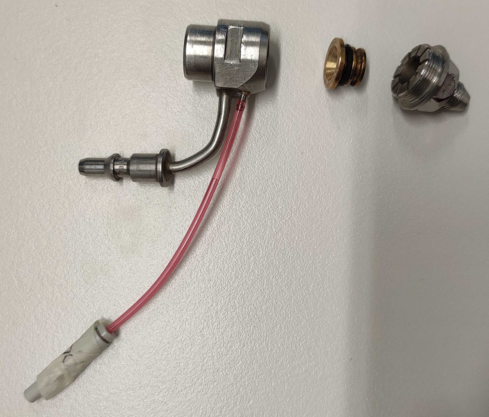

A code to interface irrigation system TESCOM ER5000, with a special nozzle from Synova to create a thin water jet.
https://www.emerson.com/en-us/catalog/tescom-er5000

The reaction time to a pressure change is ~2s, it's quite slow.

 

 